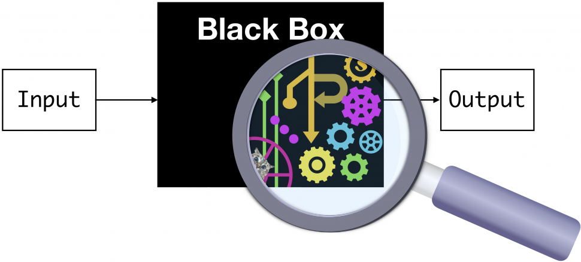
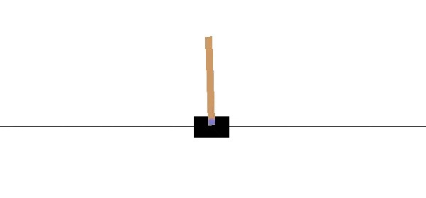
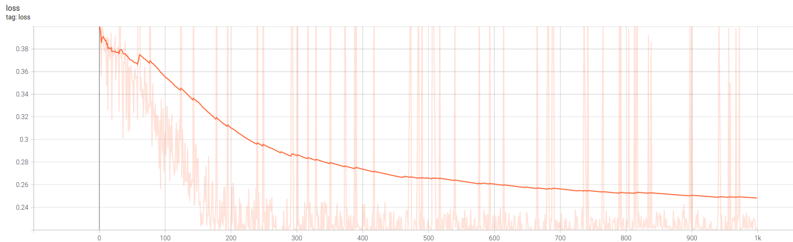
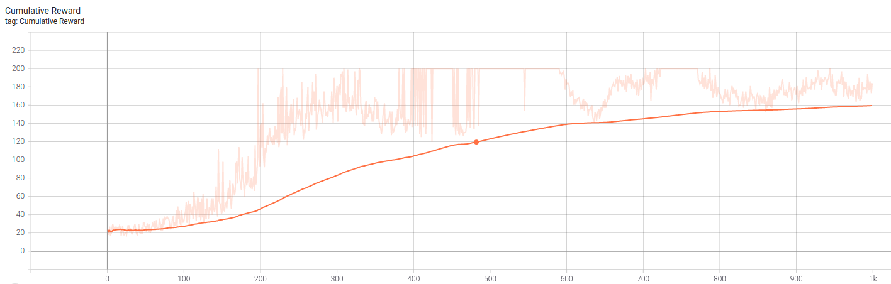

# PiRL

Programmatically Interpretable Reinforcement Learning

## Introduction



The primary goal of the project is to introduce more interpretability and transparency in RL models which are now becoming increasingly black-box based due to the advent of Deep RL without making a significant compromise in the performance gained by the SOTA DRL models. The idea is to represent a RL policy using a program written in a DSL which by its very structure/definition will be interpretable and verifiable using symbolic methods. The real challenge is how exactly to find a program which simulates a high performance policy since past attempts show that the space of programs is really large, making the search intractable and also the reward function doesn’t exactly lie on a smooth trajectory making the search even more difficult. 

## Solution Overview

The solution is based on the [research paper](https://arxiv.org/pdf/1804.02477.pdf) by Verma et al. The paper introduces the notion of a Sketch, which helps in limiting the search space by a considerable factor and then instead of learning the program directly from the environment, the search is shifted to a Imitation Learning based space where the aim is to find a program that resembles behaviour with a high performing DRL model(a neural oracle). Below is a detailed analysis of our experiments on three diverse environments. Also, in-depth analysis and theory can be found in our progress reports in the Reports [directory](./Reports).

## Cartpole



For the oracle/teacher network we trained using a simple Monte Carlo algorithm that performed fairly well with a consistent cumulative reward of over 200. We used a quite simple sketch for the program generation as given below where E represents our program's parse tree root:

```
<E>;
<E> -> <if>;
<if> -> if <B> then <left> else <right>;
<B> -> <cond>;
<cond> -> <t0> + <t1> + <t2> + <t3> > <var5>;
<t0> -> <var1>*peek(<input1>);
<t1> -> <var2>*peek(<input2>);
<t2> -> <var3>*peek(<input3>);
<t3> -> <var4>*peek(<input4>);
<var1> -> c1;
<var2> -> c2;
<var3> -> c3;
<var4> -> c4;
<var5> -> c5;
<left> -> 0;
<right> -> 1;
<input1> -> h1;
<input2> -> h2;
<input3> -> h3;
<input4> -> h4;
```

Our program generation module generated the following program using the above sketch:
```
if c1*peek(h1) + c2*peek(h2) + c3*peek(h3) + c4*peek(h4) > c5 
then 
    0 
else 
    1
```

Then we applied our parameter optimization module on this program to find optimal values for c1, c2, c3, c4 and c5. We chose a simple/intuitive loss function to begin with:

*Loss = (Oracle(obs) - prog(obs))<sup>2<sup>*

where obs is nothing but [h1, h2, h3, h4].


Decrease in loss with time.


Increase in cumulative reward with time.

We managed to achieve a decent training curve using 1000 episodes of training with a learning rate of 5e-3 along with the TensorFlow Adam Optimizer. The final optimized program we got is given below which performs consistently with a 180+ cumulative reward. One can also check its performance by simply using the program below(minor tweaks to convert into the Python syntax might be required). 
```
if 0.116*peek(h1)-0.686*peek(h2)-1.158*peek(h3)-1.434*peek(h4) > -0.345 
then 
    0 
else 
    1
```
**Note:** The peek() operator simply gives the latest observation from the particular sensor.

Similarly, our framework managed to achieve SOTA results for the MountainCarContinuous environment, detailed performance analysis can be found in [Report-8](./Reports/PiRL%20Report-8.pdf). However our framework is yet to achieve good results on the BipedalWalker environment, we believe it is due to the extremely sensitive behavious of the environment. The template code is already available for BipedalWalker, and any contributions are more than welcome.

**Note:** We didn't actually use the Neighbourhood Pooling module in any of the above environments but it can definitely be of advantage for complex sketches.

## How To Run

```bash
foo@bar:~/PiRL$ cd Cartpole
foo@bar:~/PiRL/Cartpole$ python3 train.py < Cartpole.txt
```
Cartpole.txt contains the sketch and the grammar for writing sketches can be found in MetaGrammar.g4.

## Major Libraries

* Tensorflow
* Treelib
* Antlr4

## Authors

* [Vaibhav Garg](https://github.com/VAIBHAV-2303)
* [Kartik Gupta](https://github.com/alti-tude)